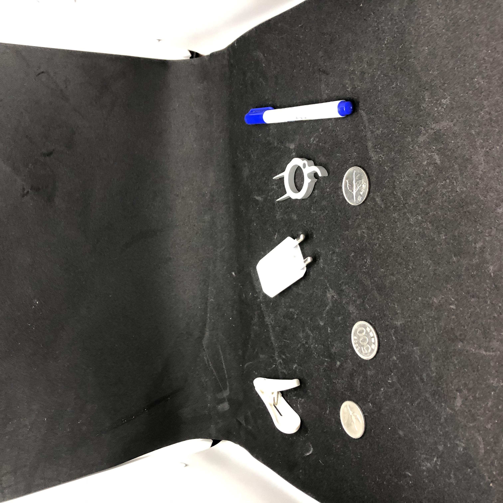
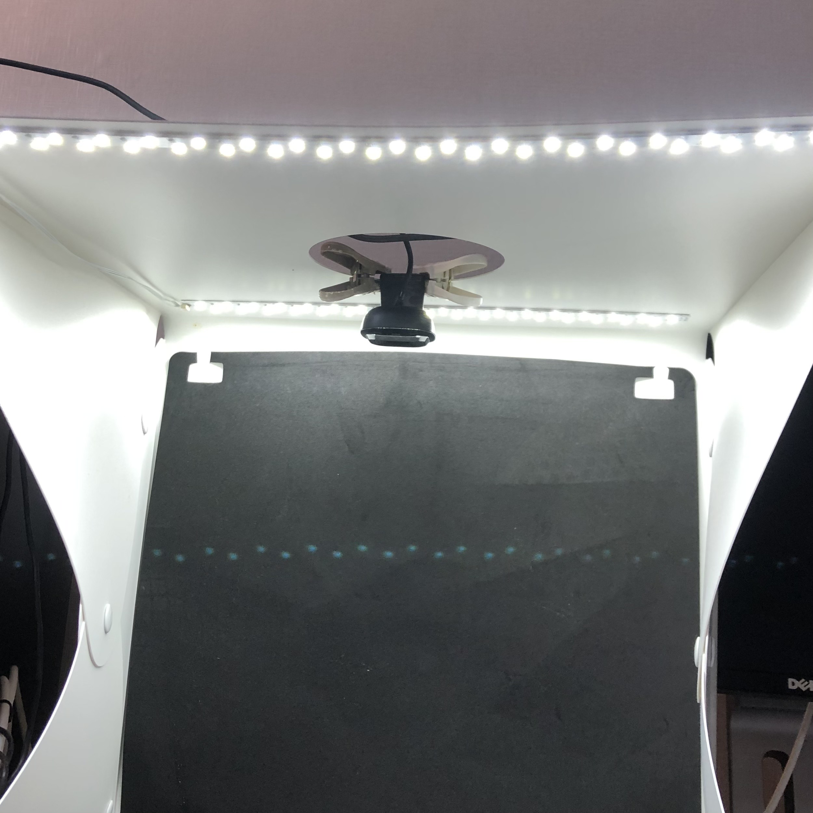
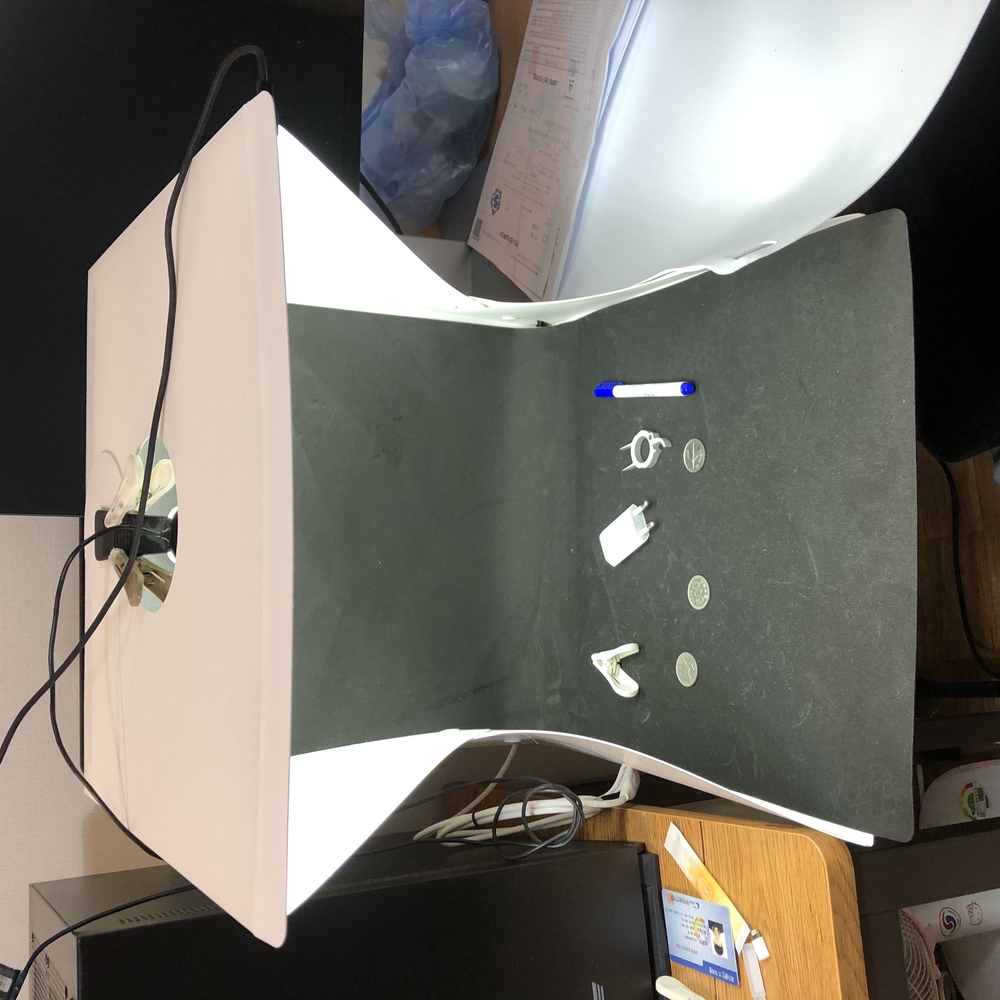
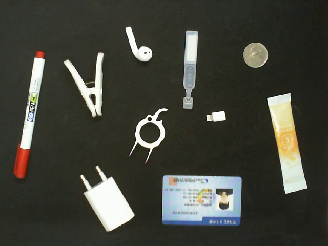
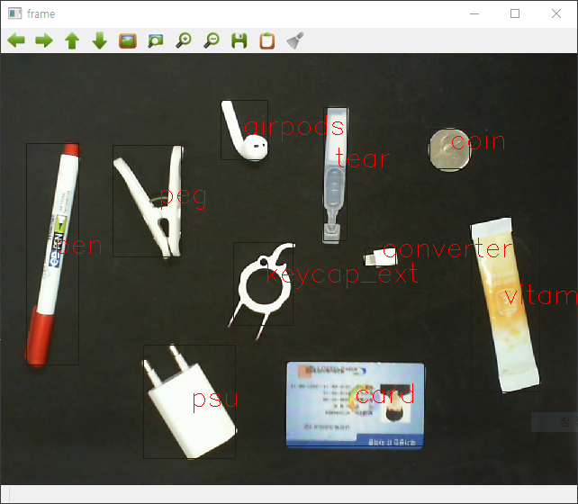

# 영상 분석 기말 프로젝트

- 이미지 분석 과정은 [notebooks/analysis.ipynb](./notebooks/analysis.ipynb, "notebook link") 파일에 있습니다.
- m20518 파이썬 패키지에 모폴로지 함수와, 라벨링 함수를 구현하였습니다.
- 직접 구현한 패키지의 속도가 너무 느리기 때문에, cv를 부분적으로 사용한 확인용 [main_video_with_cv](./main_video_with_cv.py, "src link") 파일과 직접 구현한 패키지만을 사용한 [main_video_without_cv.py](./main_video_without_cv.py, "src2 link") 파일 두가지가 있습니다.

## 환경

- python: 3.8.6
- opencv: 4.5.0
- pandas: 1.1.3
- 카메라: Microsoft HD-3000
- [Photo Booth(쿠팡)](https://www.coupang.com/vp/products/2275322171?itemId=3904182094&vendorItemId=71888760057&q=%ED%8F%AC%ED%86%A0%EB%B6%80%EC%8A%A4&itemsCount=36&searchId=1b82928879c14e90bf79ba49d111db3e&rank=3&isAddedCart=, "coupang link")

### 예시

## 결과

